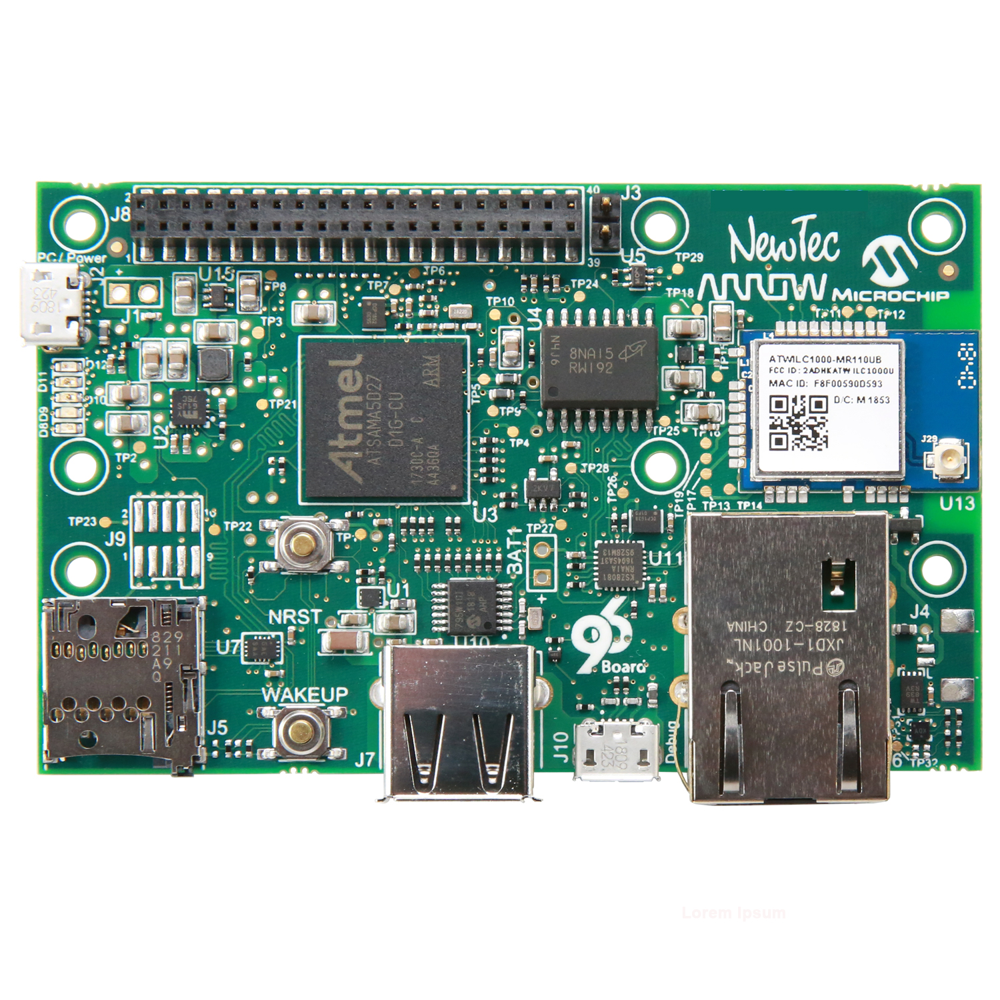

**Shield96** - [Click here to purchase](https://www.arrow.com/en/research-and-events/articles/the-shield96-development-boards)
====================================================

**Story**
------------------------
Advanced Hardware Security for IoT at Scale
The Shield96 Standard reference platform provides a secure solution applicable across all IoT verticals. This trusted Linux turn-key solution addresses hardware security by design.
The Shield96 Trusted Platform Board based on Microchip silicon is available preloaded with the EmSPARK Security Suite by Sequitur Labs. This provides a secure platform applicable across all IoT verticals to enable secure devices and protect firmware, keys and data throughout the lifecycle of a product. EmSPARK is the essential software companion suite complementing the Microchip hardware providing a cost-effective solution appropriate for every connected device built with the ATSAMA5D2 processor. Engineers can leverage this solution for digital transformation built on trust extracting the full value of the advanced embedded security features of the ATSAMA5D2 MPU.

**Details**
------------------------
- EmSPARK Security Suite for Shield96 Board [documentation and download](https://github.com/ArrowElectronics/hd96/blob/master/hd96_trusted_platform/EmSPARKSecuritySuite_ForHelmsDeep96_OnePagerFlyer_FINAL_12122019.pdf) 
- [Getting Started with AWS IoT Core and Shield96 using EmSPARK Security Suite Evaluation Kit](https://github.com/ArrowElectronics/hd96/wiki/Onboarding-to-Aws-IoT-Core-with-Shield96)
- [Getting started with AWS IoT Greengrass on Shield96](https://github.com/ArrowElectronics/hd96/wiki/Using-AWS-IoT-Greengrass-with-Shield96)
- hardware_docs: schematics, Shield96 3D view
- hd96_standard/build: Linux image, Microchip SAM-BA
- hd96_standard/downloads: software examples
- hd96_standard/getting_started: guides

